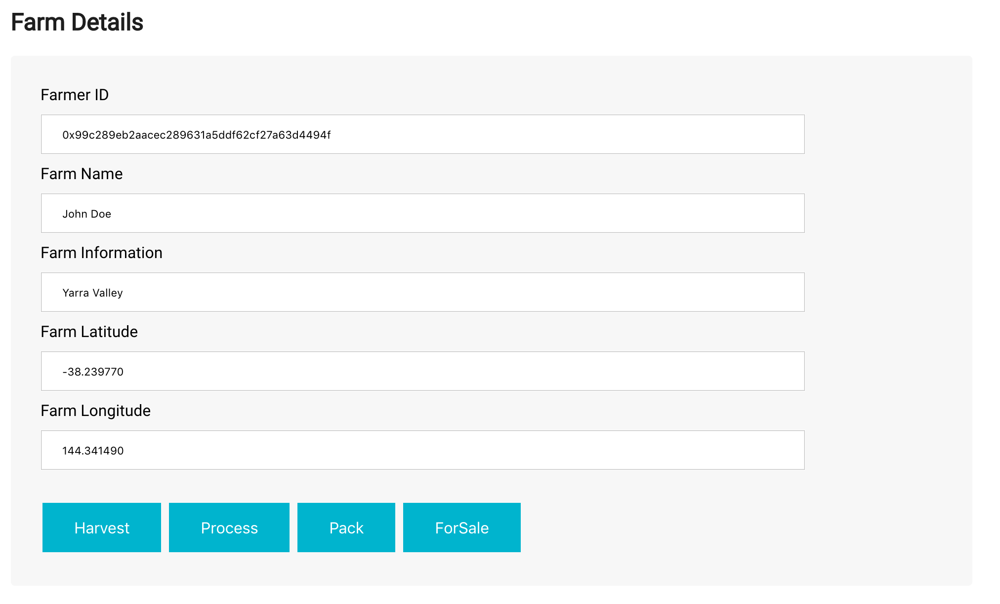
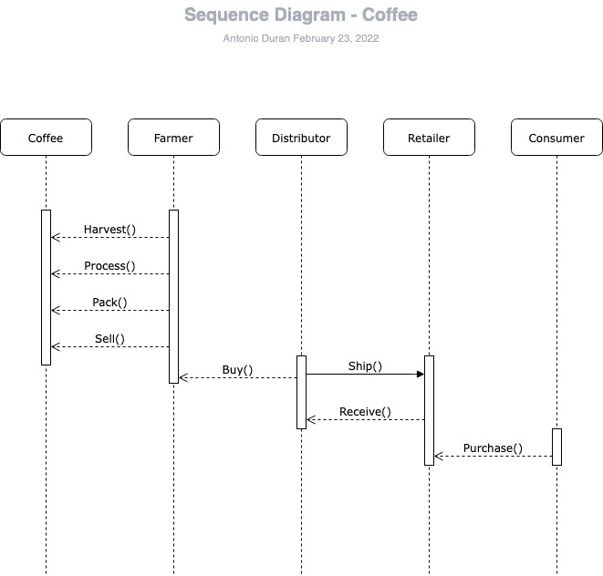
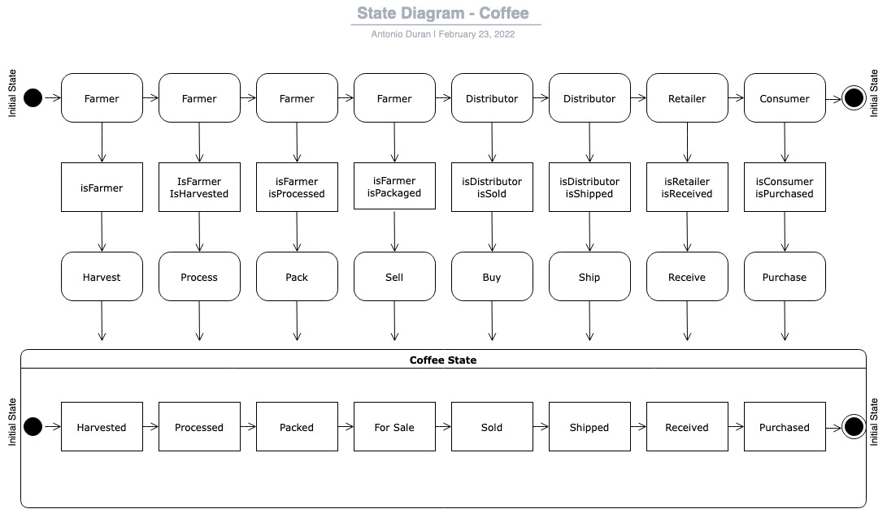
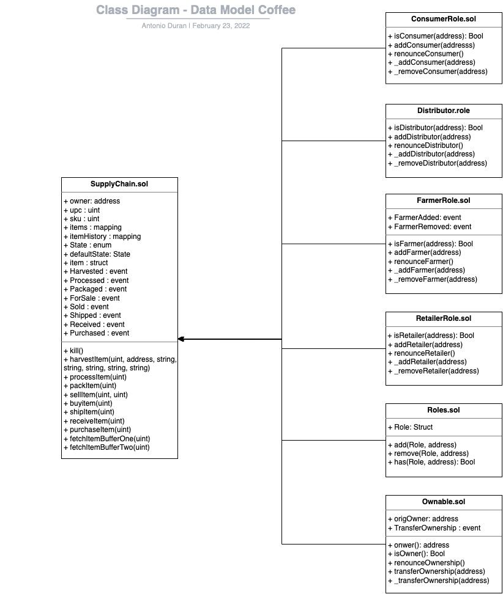
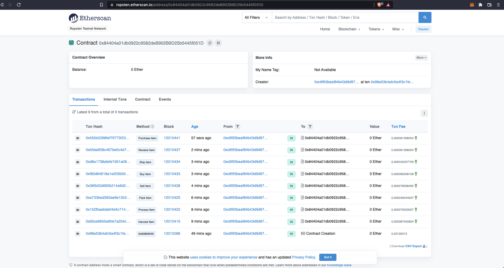
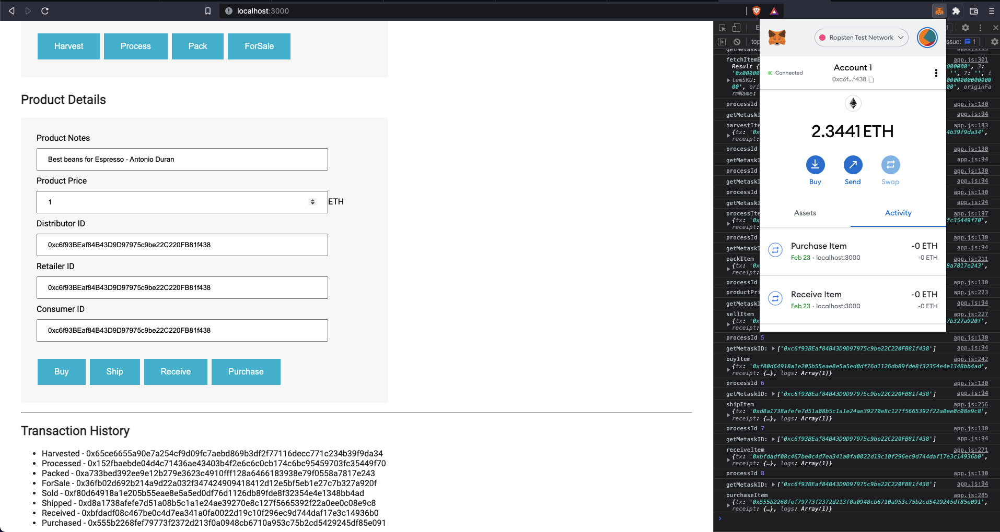

# Supply chain & data auditing

This repository containts an Ethereum DApp that demonstrates a Supply Chain flow between a Seller and Buyer. The user story is similar to any commonly used supply chain process. A Seller can add items to the inventory system stored in the blockchain. A Buyer can purchase such items from the inventory system. Additionally a Seller can mark an item as Shipped, and similarly a Buyer can mark an item as Received.

The DApp User Interface when running should look like...





## UML Diagrams








## Getting Started

These instructions will get you a copy of the project up and running on your local machine for development and testing purposes. See deployment for notes on how to deploy the project on a live system.

### Prerequisites

Please make sure you've already installed ganache-cli, Truffle and enabled MetaMask extension in your browser.


### Installing

Clone this repository:

```
git clone https://github.com/antonioduran/blockchainDeveloper-udacity-nanodegree
```

Change directory to ```Project_3_Supply_Chain/project-6``` folder and install all requisite npm packages (as listed in ```package.json```):

```
cd project-6
npm install
```

Launch Ganache:

```
ganache-cli -m "spirit supply whale amount human item harsh scare congress discover talent hamster"
```

Your terminal should look something like this:


In a separate terminal window, Compile smart contracts:

```
truffle compile
```

Your terminal should look something like this:


This will create the smart contract artifacts in folder ```build\contracts```.

Migrate smart contracts to the locally running blockchain, ganache-cli:

```
truffle migrate
```

Your terminal should look something like this:


Test smart contracts:

```
truffle test
```

All 10 tests should pass.


In a separate terminal window, launch the DApp:

```
npm run dev
```

## Built With

* [Ethereum](https://www.ethereum.org/) - Ethereum is a decentralized platform that runs smart contracts
to make the web faster, safer, and more open.
* [Truffle Framework](http://truffleframework.com/) - Truffle is the most popular development framework for Ethereum with a mission to make your life a whole lot easier.


## Authors

Antonio Duran & Udacity

## Specs

* Solidity >=0.8.0
* Ganache CLI v6.12.2 (ganache-core: 2.13.2)
* Truffle v5.4.29
* Node v14.17.0

## Dependencies

* web3 ^1.7.0
* @truffle/hdwallet-provider ^2.0.3
* truffle-assertions ^0.9.2

## Deploy to Ropsten Network



## Log & Ropsten Etherscan
https://ropsten.etherscan.io/address/0x84404a01db0922c9582deB902B9D25b5445f051D
https://github.com/antonioduran/blockchainDeveloper-udacity-nanodegree/tree/main/Project_3_Supply_Chain/project-6/log_deploy_ropsten.txt
