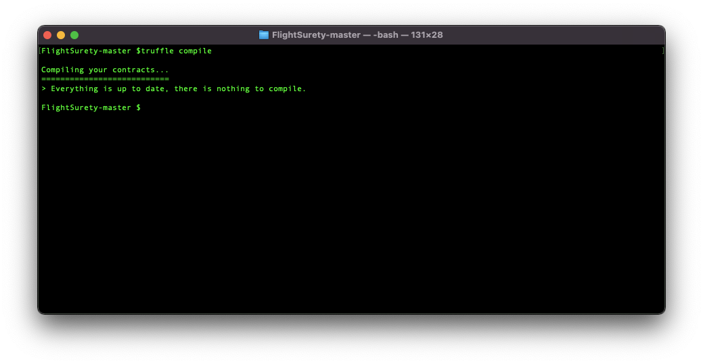
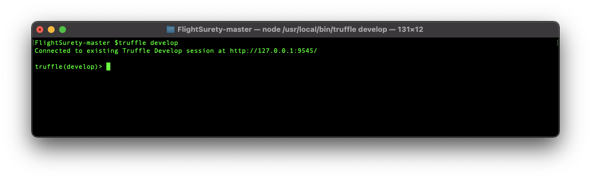
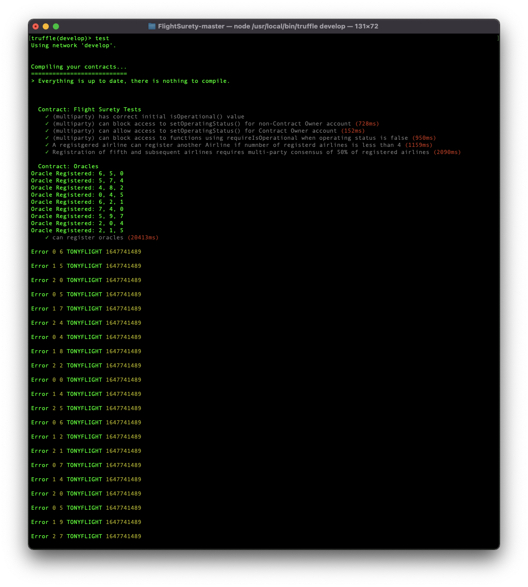
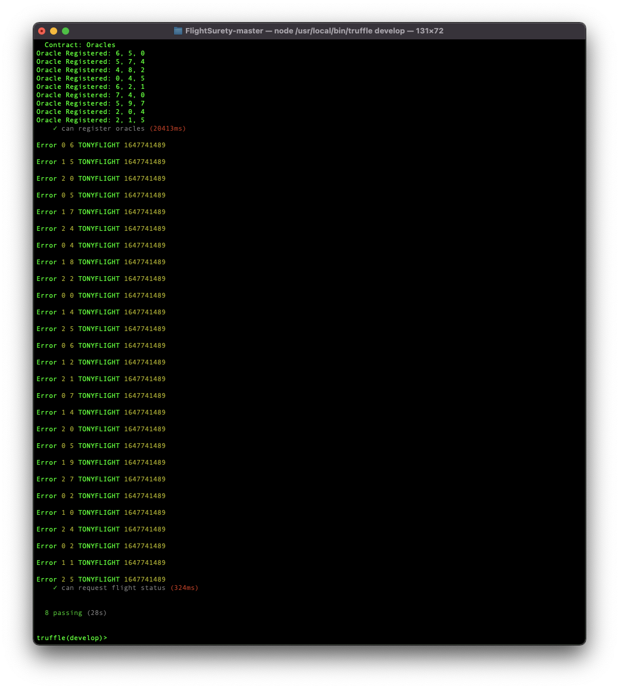
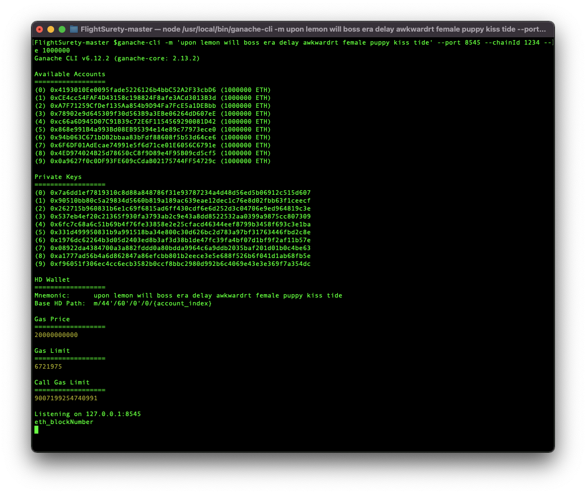
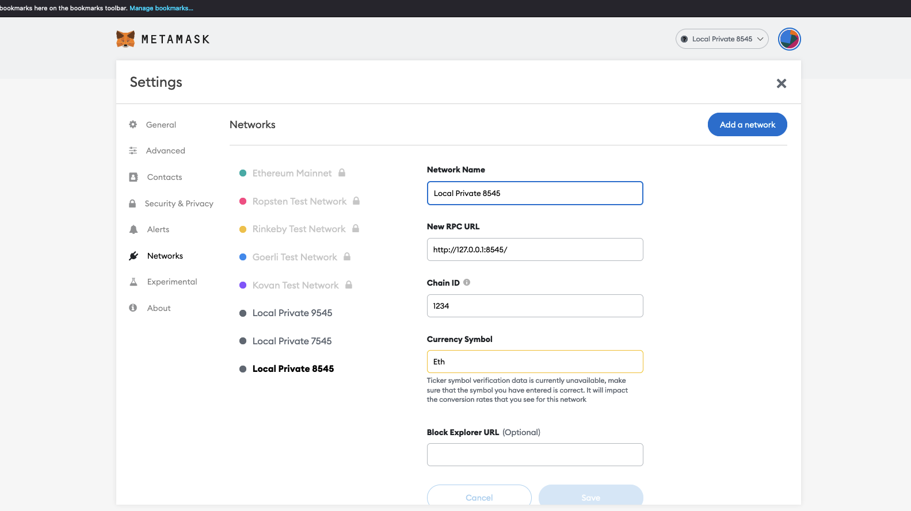
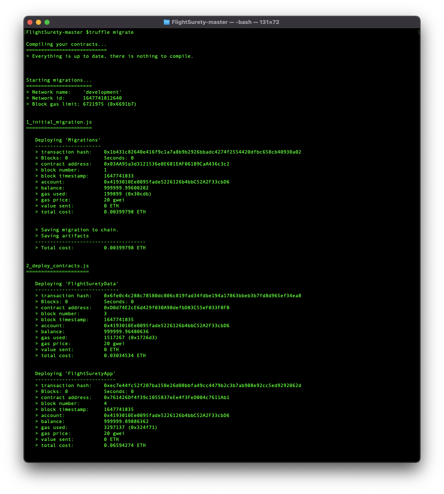
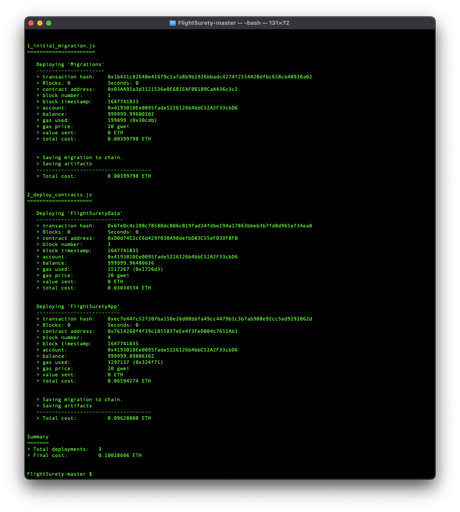
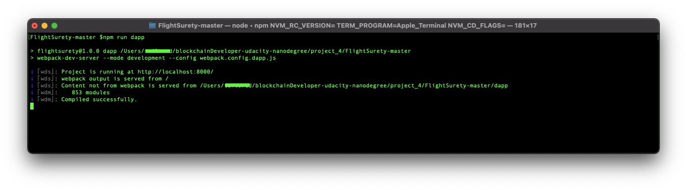
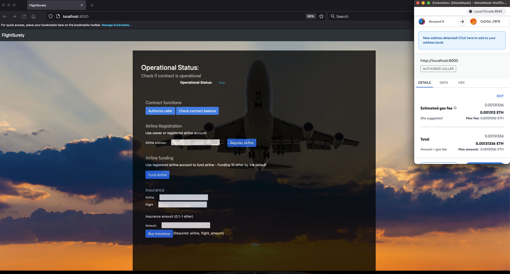

# Udacity Blockchain Developer Nanodegree Program - Project 4: FlightSurety

FlightSurety is a sample application project for Udacity's Blockchain course.

# Project Requirements / Overview

There are five main requirements for the project:

Requirement 1: Separation of Concerns

>FlightSuretyData contract for data persistance
>
>FlightSuretyApp contract for app logic and oracles code
>
>Dapp client for triggering contact calls
>
>Server app for simulating oracles

Requirement 2: Airlines
>Register first airline when contract is deployed
>
>Only existing airline may register a new airline until there are at least four airlines registered
>
>Registration of fifth and subsequent airlines requires multi-party consensus of 50% of registered airlines
>
>Airline can be registered, but does not participate in contract until it submits funding of 10 ethet

Requirement 3: Passengers

>Passengers may pay upto 1 ether for purchaing flight insurance
>
>Flight numbers and timestamps are fixed for the purpose of the project and can be defined in the Dapp client
>
>If flight is delayed due to airline fault, passenger receives credit of 1.5X the amount they paid
>
>Funds are transferred from contract to the passengers wallet only when they initiate a withdrawal

Requirement 4: Oracles

>Oracles are implemented as a server app
>
>Upon startup, 20+ oracles are registered and their assigned indexes are persisted in memory
>
>Client dapp is used to trigger request to update flight status generating OracleRequest event that is captured by server
>
>Server will loop through all registered oracles, identify those oracles for which the request applies, and respond by calling into app logic contract with the appropiate status code

Requirement 5: General

>Contracts must have operational status control
>
>Functions must fail fast - use require() at the start of functions
>
>Scaffolding code is provided but you are free to replace it with your own code
>
>Have fun learning!

## Install

To install, download or clone the repo, then:

`npm install`

## Develop Client

Compile project

`truffle compile`

To run truffle tests:

`truffle develop`

After that execute:

`test`

Run ganache cli:

`ganache-cli -m 'upon lemon will boss era delay awkwardrt female puppy kiss tide' --port 8545 --chainId 1234 --e 1000000`

It will be needed to have a local private configured with the port 8545 from metamask, and the chain ID 1234, and import couple accounts from ganache cli.

To use the dapp:

`truffle migrate`

`npm run dapp`

To view dapp:

`http://localhost:8000`

## Develop Server

`npm run server`

## Resources

* [How does Ethereum work anyway?](https://medium.com/@preethikasireddy/how-does-ethereum-work-anyway-22d1df506369)
* [BIP39 Mnemonic Generator](https://iancoleman.io/bip39/)
* [Truffle Framework](http://truffleframework.com/)
* [Ganache Local Blockchain](http://truffleframework.com/ganache/)
* [Remix Solidity IDE](https://remix.ethereum.org/)
* [Solidity Language Reference](http://solidity.readthedocs.io/en/v0.4.24/)
* [Ethereum Blockchain Explorer](https://etherscan.io/)
* [Web3Js Reference](https://github.com/ethereum/wiki/wiki/JavaScript-API)

## Specs

* Solidity >=0.8.0
* Ganache CLI v6.12.2 (ganache-core: 2.13.2)
* Truffle v5.4.29
* Node v14.17.0

## License

- **[MIT license](http://opensource.org/licenses/mit-license.php)**
