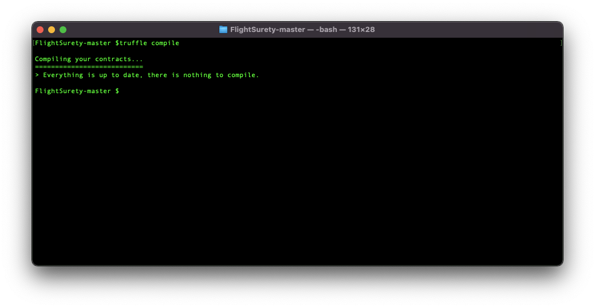
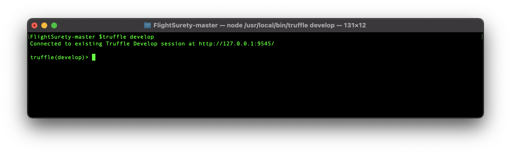
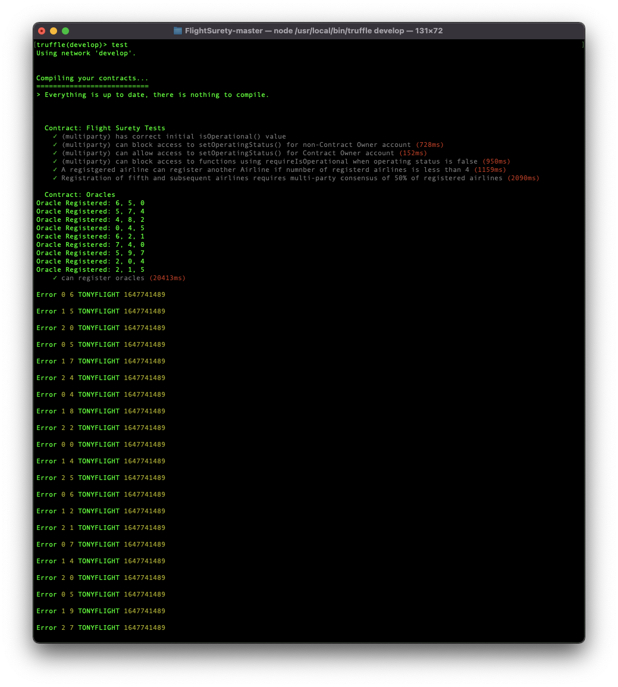
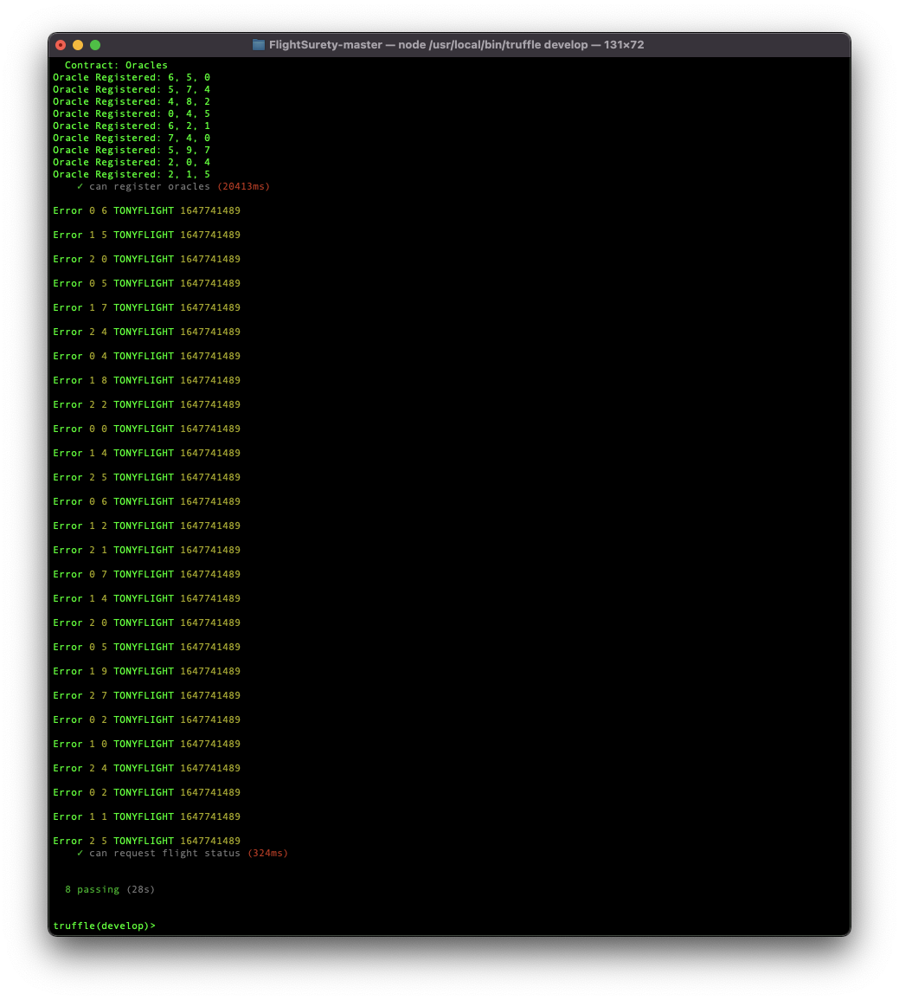
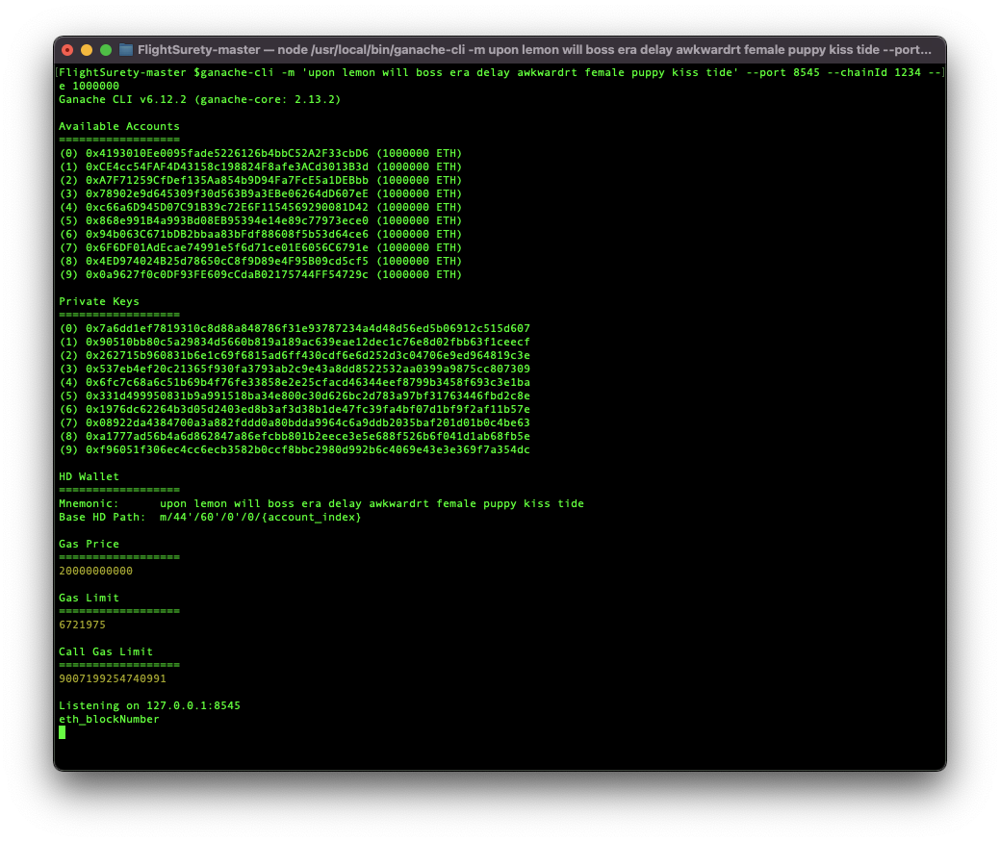
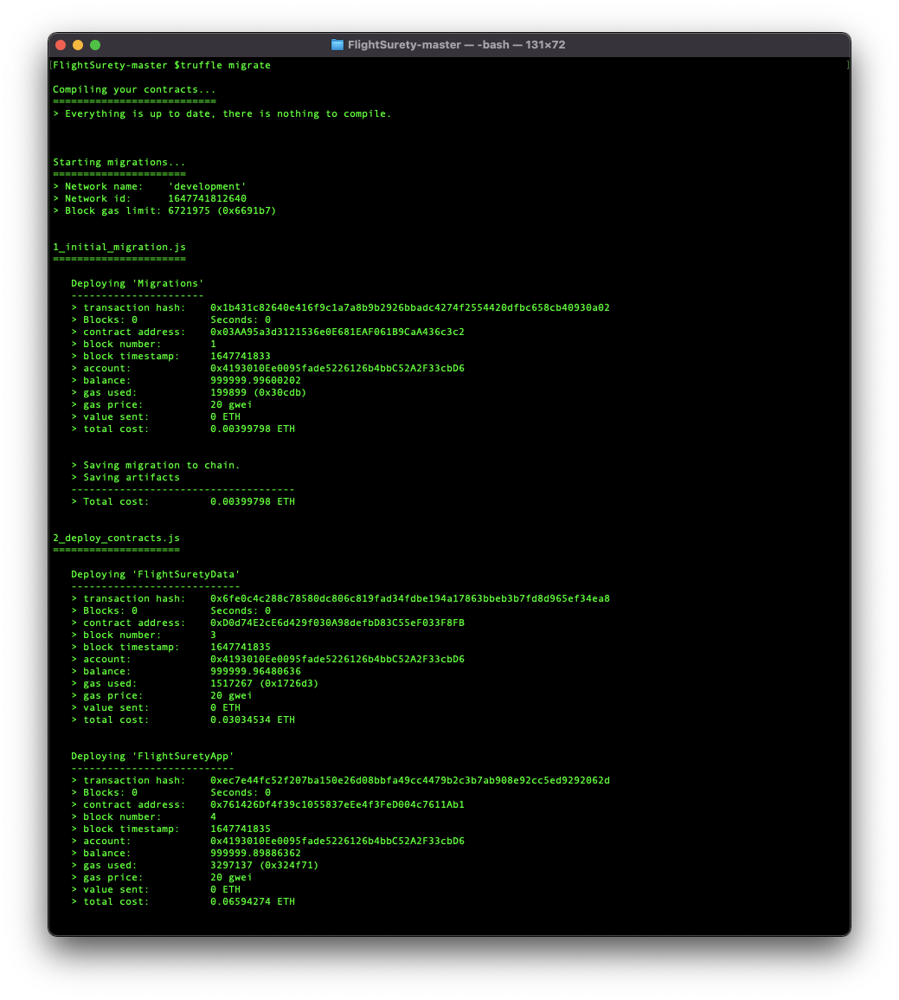
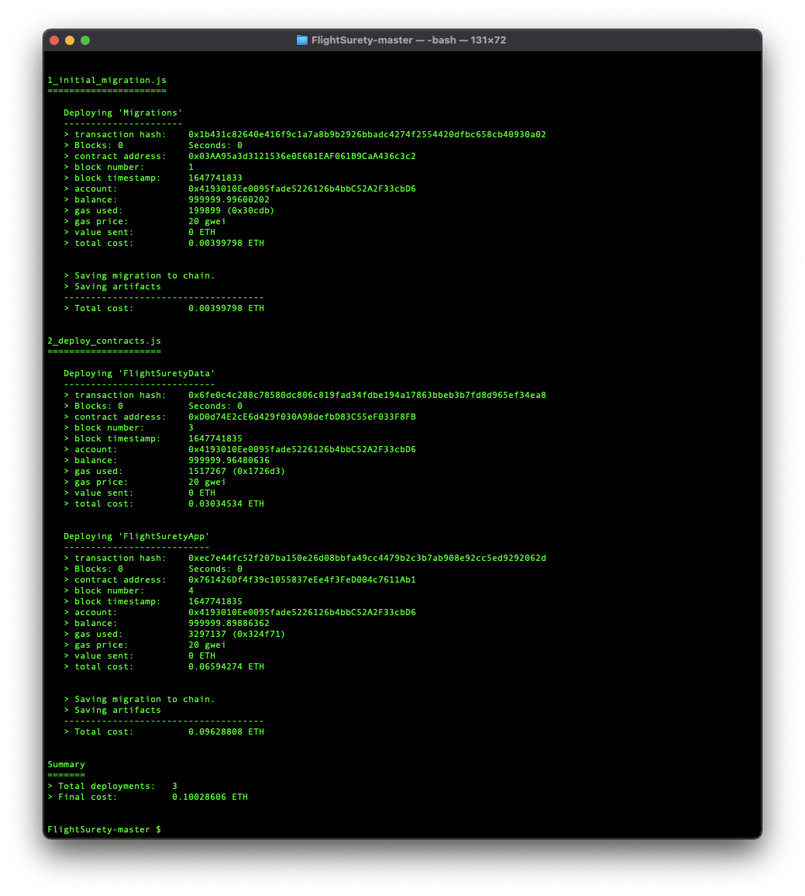
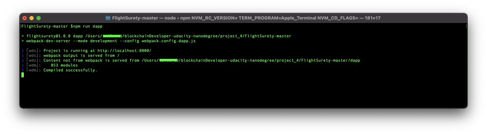
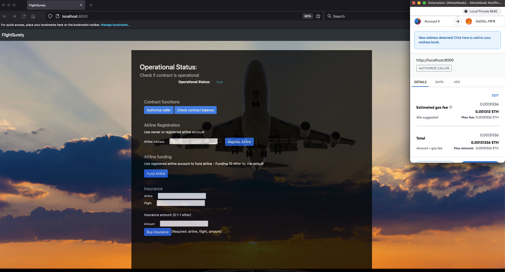

# Udacity Blockchain Developer Nanodegree Program - Project 4: FlightSurety

FlightSurety is a sample application project for Udacity's Blockchain course.

## Install

To install, download or clone the repo, then:

`npm install`

## Develop Client

Compile project

`truffle compile`

To run truffle tests:

`truffle develop`

After that execute:

`test`

Run ganache cli:

`ganache-cli -m 'upon lemon will boss era delay awkwardrt female puppy kiss tide' --port 8545 --chainId 1234 --e 1000000`

To use the dapp:

`truffle migrate`

`npm run dapp`

To view dapp:

`http://localhost:8000`

## Develop Server

`npm run server`

## Resources

* [How does Ethereum work anyway?](https://medium.com/@preethikasireddy/how-does-ethereum-work-anyway-22d1df506369)
* [BIP39 Mnemonic Generator](https://iancoleman.io/bip39/)
* [Truffle Framework](http://truffleframework.com/)
* [Ganache Local Blockchain](http://truffleframework.com/ganache/)
* [Remix Solidity IDE](https://remix.ethereum.org/)
* [Solidity Language Reference](http://solidity.readthedocs.io/en/v0.4.24/)
* [Ethereum Blockchain Explorer](https://etherscan.io/)
* [Web3Js Reference](https://github.com/ethereum/wiki/wiki/JavaScript-API)

## Specs

* Solidity >=0.8.0
* Ganache CLI v6.12.2 (ganache-core: 2.13.2)
* Truffle v5.4.29
* Node v14.17.0

## License

- **[MIT license](http://opensource.org/licenses/mit-license.php)**
